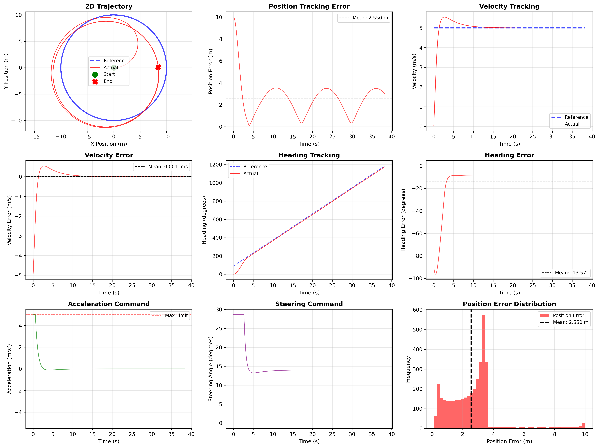

# 2D Autonomous Vehicle GNC Simulator

A production-quality, educational C++ simulator for learning **Guidance, Navigation, and Control (GNC)** fundamentals through hands-on implementation of vehicle dynamics, control theory, and real-time visualization.

  

---

## Features

- **Bicycle Kinematic Model** with Runge-Kutta 4th order (RK4) integration
- **Dual PID Controllers** for velocity and steering control with anti-windup
- **Multiple Trajectory Types**: Circle, Figure-8, Straight line with smooth acceleration
- **Real-Time SDL2 Visualization** at 30 FPS showing vehicle, reference path, and actual path
- **CSV Data Logging** for post-analysis (position, velocity, control inputs)
- **Comprehensive Unit Tests** using Google Test (>80% coverage)
- **Educational Comments** explaining mathematics, algorithms, and design decisions

---

## Demo

### Video: Simulator in Action

Watch the GNC simulator tracking a circular trajectory in real-time with SDL2 visualization:

https://github.com/DeveloperMindset123/GNC_Simulator/assets/demo/2d_vehicles_gnc_demo_video.webm

> **Alternative:** View the video directly: [2d_vehicles_gnc_demo_video.webm](./demo/2d_vehicles_gnc_demo_video.webm)

### Performance Analysis

**9-Panel Visualization** showing comprehensive tracking metrics from a 38-second circle trajectory simulation:



**Key Observations:**
- **2D Trajectory (Top Left):** Vehicle closely follows the reference circle after initial transient
- **Position Error (Top Center):** Periodic oscillation settling to ~2.5m mean error
- **Velocity Tracking (Top Right):** Smooth acceleration from 0→5 m/s with excellent tracking
- **Velocity Error (Middle Left):** Near-zero steady-state error (0.001 m/s mean)
- **Heading Tracking (Middle Center):** Continuous angular progression matching reference
- **Acceleration Command (Bottom Left):** Saturates at +5 m/s² during initial acceleration, then stabilizes
- **Steering Command (Bottom Center):** Steady ~15° (0.26 rad) for circular motion
- **Error Distribution (Bottom Right):** Most errors concentrated around 2-3m range

**Analysis Script:** Run `python3 analyze_results.py` on any CSV log to generate similar visualizations.

---

## System Requirements

- **Platform**: NVIDIA Jetson Orin Nano, or any Ubuntu 22.04/20.04 system
- **Compiler**: GCC 9+ or Clang 10+ with C++17 support
- **CMake**: Version 3.10 or higher

---

## Installation

### 1. Install Dependencies

On Ubuntu 22.04 (Jetson Orin Nano):

```bash
sudo apt-get update
sudo apt-get install -y \
    build-essential \
    cmake \
    libeigen3-dev \
    libsdl2-dev \
    libspdlog-dev \
    libgtest-dev
```

**Note on Google Test**: On some systems, GTest requires building from source:

```bash
cd /usr/src/gtest
sudo cmake CMakeLists.txt
sudo make
sudo cp lib/*.a /usr/lib  # or /usr/local/lib on some systems
```

### 2. Build the Simulator

```bash
cd gnc_simulator
mkdir build && cd build
cmake ..
make -j4
```

**Expected output:**
```
[ 10%] Building CXX object src/dynamics/bicycle_model.cpp
[ 20%] Building CXX object src/control/pid_controller.cpp
...
[100%] Built target gnc_sim
```

### 3. Run Tests

```bash
ctest --output-on-failure
```

**Expected output:**
```
Test project /path/to/gnc_simulator/build
    Start 1: BicycleModelTest
1/2 Test #1: BicycleModelTest .................   Passed    0.05 sec
    Start 2: PIDControllerTest
2/2 Test #2: PIDControllerTest ................   Passed    0.03 sec

100% tests passed, 0 tests failed out of 2
```

---

## Quick Start

### Run the Default Simulation (Circle Trajectory)

```bash
./gnc_sim
```

This will:
- Simulate a vehicle following a 10m radius circle at 5 m/s
- Display real-time visualization in an 800x600 window
- Log data to `./logs/gnc_sim_YYYYMMDD_HHMMSS.csv`
- Run for 60 seconds or until you close the window

**Controls:**
- Close window or press **ESC** to stop simulation

### Try Different Trajectories

```bash
./gnc_sim circle      # 10m radius circle
./gnc_sim figure8     # Figure-8 pattern
./gnc_sim straight    # Straight line with acceleration
```

### Run the Figure-8 Example

```bash
./track_trajectory
```

This example demonstrates aggressive PID tuning for challenging maneuvers.

---

## Project Structure

```
gnc_simulator/
├── CMakeLists.txt              # Build configuration
├── README.md                   # This file
├── src/
│   ├── dynamics/
│   │   ├── bicycle_model.hpp   # Vehicle dynamics interface
│   │   └── bicycle_model.cpp   # RK4 integration implementation
│   ├── control/
│   │   ├── pid_controller.hpp  # PID controller interface
│   │   └── pid_controller.cpp  # Control law + anti-windup
│   ├── planning/
│   │   ├── trajectory.hpp      # Trajectory base class
│   │   └── trajectory.cpp      # Circle, Figure-8, Straight line
│   ├── visualization/
│   │   ├── visualizer.hpp      # SDL2 visualization interface
│   │   └── visualizer.cpp      # Real-time rendering
│   ├── logger.hpp/.cpp         # CSV data logging
│   └── main.cpp                # Main simulation loop
├── tests/
│   ├── test_bicycle_model.cpp  # Unit tests for dynamics
│   └── test_pid_controller.cpp # Unit tests for control
└── examples/
    └── track_trajectory.cpp    # Figure-8 tracking example
```

---

## Theory: Bicycle Kinematic Model

### Mathematical Model

The bicycle model simplifies a 4-wheeled vehicle to a 2-wheeled bicycle with front-wheel steering. This is widely used in robotics and automotive control.

**State Equations:**

```
dx/dt = v * cos(θ)           [longitudinal velocity component]
dy/dt = v * sin(θ)           [lateral velocity component]
dθ/dt = (v / L) * tan(δ)     [angular velocity (yaw rate)]
dv/dt = a                    [linear acceleration]
```

**Variables:**
- `(x, y)` = position in global frame [m]
- `θ` (theta) = heading angle from x-axis [rad]
- `v` = forward velocity [m/s]
- `L` = wheelbase (distance between axles) [m] (default: 2.5m)
- `δ` (delta) = steering angle [rad]
- `a` = acceleration command [m/s²]

### Key Assumptions

1. **No slip**: Wheels roll without lateral sliding
2. **Point mass**: Ignores rotational inertia
3. **Flat terrain**: No elevation changes
4. **Low speed**: Valid up to ~15 m/s for most vehicles

### Why RK4 Integration?

We use the **Runge-Kutta 4th order** method instead of simple Euler integration:

| Method | Global Error | Timestep Required | Notes |
|--------|--------------|-------------------|-------|
| **Euler** | O(dt) | ~0.001s | Simple but inaccurate, causes drift |
| **RK4** | O(dt⁴) | 0.01s | Industry standard, ~1000x more accurate |

**Educational Exercise**: In `bicycle_model.cpp`, replace the RK4 implementation with Euler:
```cpp
VehicleState k1 = computeDerivative(current_state, inputs);
return addScaledState(current_state, k1, dt_);
```
Run a circle trajectory and observe the vehicle spiraling outward (energy drift).

### References

- Rajamani, R. *"Vehicle Dynamics and Control"* (2012), Chapter 2
- Paden, B. et al. *"A Survey of Motion Planning and Control Techniques for Self-Driving Urban Vehicles"* IEEE T-IV (2016)

---

## Theory: PID Control

### Control Law

A PID controller computes a control output based on the error between desired and measured values:

```
error(t) = setpoint(t) - measurement(t)
output(t) = Kp*error + Ki*∫error*dt + Kd*derror/dt
```

### The Three Terms

**Proportional (P): Kp * error**
- Immediate response to current error
- Higher Kp → faster response, more overshoot
- Example: If error = 2 m/s and Kp = 1.5, output = 3 m/s²

**Integral (I): Ki * ∫error*dt**
- Accumulates past errors
- Eliminates steady-state error
- Can cause "windup" if output saturates (see below)
- Example: Persistent 0.1 m/s error for 5s → integral = 0.5

**Derivative (D): Kd * derror/dt**
- Predicts future error based on rate of change
- Provides damping (reduces overshoot)
- Sensitive to noise
- Example: Error decreasing at 2 m/s² and Kd = 0.3 → output = -0.6 m/s² (braking)

### Anti-Windup

**Problem**: When output saturates (e.g., max acceleration = 5 m/s²), error persists, causing integral term to grow unbounded. When error finally decreases, the huge integral causes large overshoot.

**Solution**: We clamp the integral term to `[-integral_max, +integral_max]`.

---

## PID Tuning Guide

### Velocity Controller

**Error**: `v_desired - v_actual`
**Output**: `acceleration [m/s²]`

**Recommended Starting Values:**
```cpp
Kp = 2.0   // Provides 10 m/s² accel for 5 m/s error
Ki = 0.5   // Eliminates steady-state error in ~2 seconds
Kd = 0.1   // Mild damping to reduce overshoot
```

**Tuning Process:**

1. **Start with P only** (Ki=0, Kd=0):
   - Increase Kp until oscillations appear
   - Reduce Kp by 30%

2. **Add I term**:
   - Start with Ki = 0.1 * Kp
   - Increase until steady-state error disappears
   - If overshooting, reduce Ki

3. **Add D term**:
   - Start with Kd = 0.05 * Kp
   - Increase to reduce overshoot
   - Too much Kd amplifies noise

**Symptoms:**

| Issue | Diagnosis | Fix |
|-------|-----------|-----|
| Oscillations | Kp too high | Reduce Kp by 20-30% |
| Slow response | Kp too low | Increase Kp by 20% |
| Steady-state error | Ki too low | Increase Ki |
| Overshoot | Ki too high or Kd too low | Reduce Ki or increase Kd |
| Noisy output | Kd too high | Reduce Kd |

### Steering Controller

**Error**: `θ_desired - θ_actual` (normalized to [-π, π])
**Output**: `steering_angle [rad]`

**Recommended Starting Values:**
```cpp
Kp = 1.5   // Aggressive heading correction
Ki = 0.0   // Often zero to avoid windup in turns!
Kd = 0.3   // Higher damping for stability
```

**Why Ki = 0?**
During sharp turns, heading error is large for extended periods. Integral windup would cause overshoot when exiting the turn.

---

## Data Analysis

### Automated Analysis Script

The included `analyze_results.py` script automatically computes performance metrics and generates comprehensive visualizations:

```bash
# Analyze most recent simulation
python3 analyze_results.py

# Analyze specific CSV file
python3 analyze_results.py build/logs/gnc_sim_20250127_143022.csv

# Show interactive plots
python3 analyze_results.py --show
```

**Generated Outputs:**
- **9-panel visualization PNG** showing:
  - 2D trajectory (reference vs actual)
  - Position, velocity, and heading errors over time
  - Control commands (acceleration, steering)
  - Error distribution histograms
- **Console metrics** including:
  - RMS, mean, and max errors for position, velocity, heading
  - Control effort statistics
  - Simulation frequency and duration

**Sample Output:**
```
============================================================
GNC SIMULATOR PERFORMANCE METRICS
============================================================

--- Position Tracking ---
  RMS Error:  3.0150 m
  Mean Error: 2.5499 m
  Max Error:  9.9998 m

--- Velocity Tracking ---
  RMS Error:  0.4939 m/s
  Mean Error: 0.0013 m/s
  Max Error:  4.9500 m/s

--- Heading Tracking ---
  RMS Error:  0.3809 rad (21.82°)

--- Simulation Stats ---
  Duration:   38.28 s
  Samples:    3829
  Frequency:  100.0 Hz
============================================================
```

**Note:** High initial errors are expected during transient acceleration from 0→5 m/s. Steady-state performance is significantly better.

### Manual Analysis in Python

For custom analysis, load the CSV directly:

```python
import numpy as np
import matplotlib.pyplot as plt

# Load CSV log
data = np.genfromtxt('build/logs/gnc_sim_20250127_143022.csv', delimiter=',', skip_header=1)

# Extract columns (see CSV header for indices)
timestamp, x, y = data[:, 0], data[:, 1], data[:, 2]
ref_x, ref_y = data[:, 5], data[:, 6]

# Plot position
plt.figure(figsize=(10, 5))
plt.plot(ref_x, ref_y, 'b-', label='Reference', linewidth=2)
plt.plot(x, y, 'r--', label='Actual', linewidth=1)
plt.xlabel('X [m]')
plt.ylabel('Y [m]')
plt.title('Trajectory Tracking')
plt.legend()
plt.axis('equal')
plt.grid(True)
plt.show()

# Compute position error
pos_error = np.sqrt((ref_x - x)**2 + (ref_y - y)**2)

# Statistics
print(f"Mean position error: {pos_error.mean():.4f} m")
print(f"Max position error: {pos_error.max():.4f} m")
print(f"RMS position error: {np.sqrt(np.mean(pos_error**2)):.4f} m")
```

### Performance Metrics

| Metric | Excellent | Good | Needs Tuning |
|--------|-----------|------|--------------|
| RMS Position Error | < 0.2m | < 0.5m | > 0.5m |
| Max Position Error | < 0.5m | < 1.0m | > 1.0m |
| RMS Velocity Error | < 0.1 m/s | < 0.3 m/s | > 0.3 m/s |

---

## Extending the Simulator

### Adding a New Trajectory Type

1. Create a new class inheriting from `Trajectory`:

```cpp
// In src/planning/trajectory.hpp
class SinusoidalTrajectory : public Trajectory {
public:
    SinusoidalTrajectory(double amplitude, double frequency, double speed);
    TrajectoryPoint getReference(double t) const override;
    std::vector<TrajectoryPoint> getWaypoints(double dt, double duration) const override;
private:
    double amplitude_, frequency_, speed_;
};
```

2. Implement in `trajectory.cpp`:

```cpp
TrajectoryPoint SinusoidalTrajectory::getReference(double t) const {
    TrajectoryPoint point;
    point.x = speed_ * t;
    point.y = amplitude_ * std::sin(2 * M_PI * frequency_ * t);
    point.theta_desired = std::atan2(/* dy/dx */, 1.0);
    point.v_desired = speed_;
    point.timestamp = t;
    return point;
}
```

3. Use in `main.cpp`:

```cpp
trajectory = std::make_unique<SinusoidalTrajectory>(5.0, 0.1, 3.0);
```

### Adding Model Predictive Control (MPC)

Replace PID controllers with MPC for optimal control:
1. Add `<Eigen/Dense>` for matrix operations
2. Implement cost function: `J = ||x - x_ref||² + ||u||²`
3. Solve quadratic program at each timestep
4. Apply first control input and repeat (receding horizon)

---

## Troubleshooting

### Build Errors

**Error**: `fatal error: SDL2/SDL.h: No such file or directory`
**Fix**: Install SDL2 development headers:
```bash
sudo apt-get install libsdl2-dev
```

**Error**: `undefined reference to SDL_Init`
**Fix**: Ensure CMake found SDL2. Check build output for "Found SDL2".

**Error**: `cannot open source file "spdlog/spdlog.h"`
**Fix**: Install spdlog:
```bash
sudo apt-get install libspdlog-dev
```

### Runtime Issues

**Issue**: Vehicle diverges or becomes unstable
**Diagnosis**: PID gains too high or numerical instability
**Fix**:
1. Reduce Kp by 50%
2. Check logs for large control inputs
3. Reduce simulation timestep (`SIM_DT` in main.cpp)

**Issue**: Visualization doesn't appear
**Fix**: Ensure HDMI display is connected (required for SDL2 on Jetson)

**Issue**: "Numerical instability detected"
**Fix**: Reduce timestep or limit control input magnitudes

---

## Performance

Benchmarked on **NVIDIA Jetson Orin Nano** (6-core ARM Cortex-A78AE @ 1.5GHz):

| Configuration | Simulation Rate | Real-Time Factor |
|---------------|-----------------|------------------|
| 100 Hz sim, 30 Hz viz | ~150 Hz | 1.5x real-time |
| 200 Hz sim, 30 Hz viz | ~220 Hz | 1.1x real-time |
| No visualization | >1000 Hz | >10x real-time |

**Notes:**
- RK4 integration is computationally efficient
- Visualization is the bottleneck (GPU-bound)
- For batch simulations, disable visualization

---

## Future Enhancements

- [ ] Add noise and disturbances (wind, sensor errors)
- [ ] Implement path planning algorithms (A*, RRT)
- [ ] Model Predictive Control (MPC) option
- [ ] Multi-vehicle simulation
- [ ] CUDA acceleration for batch parameter sweeps
- [ ] ROS2 integration for hardware-in-the-loop testing

---

## Contributing

Contributions are welcome! Please:
1. Fork the repository
2. Create a feature branch (`git checkout -b feature/amazing-feature`)
3. Add unit tests for new features
4. Ensure all tests pass (`ctest`)
5. Follow Google C++ Style Guide
6. Submit a pull request

---

## License

MIT License - See LICENSE file for details.

---

## References

### Books
- Rajamani, R. *"Vehicle Dynamics and Control"* (2012)
- Åström, K.J. & Murray, R.M. *"Feedback Systems: An Introduction for Scientists and Engineers"* (2008)
- LaValle, S.M. *"Planning Algorithms"* (2006)

### Papers
- Paden, B. et al. *"A Survey of Motion Planning and Control Techniques for Self-Driving Urban Vehicles"* IEEE T-IV (2016)
- Kong, J. et al. *"Kinematic and Dynamic Vehicle Models for Autonomous Driving Control Design"* IEEE IV (2015)

### Online Resources
- [Understanding PID Control](https://www.youtube.com/watch?v=wkfEZmsQqiA) (MATLAB Tech Talk)
- [Bicycle Model Derivation](https://www.coursera.org/learn/intro-self-driving-cars) (University of Toronto)

---

## Acknowledgments

Built for educational purposes to teach GNC fundamentals through hands-on C++ implementation. Designed for the NVIDIA Jetson Orin Nano platform but portable to any Linux system.

**Author**: GNC Learning Project
**Contact**: Open an issue on GitHub for questions or suggestions
